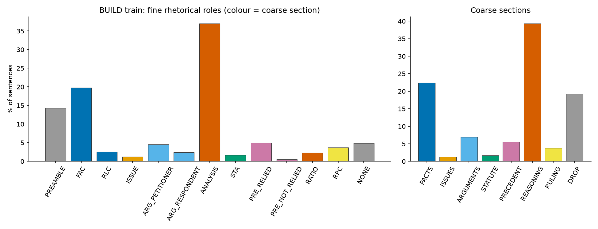

# LexBrief data statistics

Generated by `lexbrief prepare-data`. BUILD = InRhetoricalRoles (sentence-level gold roles); IN-Ext = 50 judgments with A1/A2 expert extractive summaries.

- BUILD `test.json` labelled: **True** -> train/dev/test used as train/val/test.
- IN-Ext roles are **segment_inferred** (no per-sentence gold roles in the release): a judgment sentence takes the role of the summary segment(s) it aligns to; unaligned sentences are UNLABELLED.

## Documents and sentences per split

| split | documents | sentences | sent/doc |
|---|---|---|---|
| build_train | 245 | 28848 | 117.700 |
| build_val | 30 | 2873 | 95.800 |
| build_test | 50 | 4137 | 82.700 |
| inext | 50 | 8656 | 173.100 |

## Tokens per sentence (law-ai/InLegalBERT, BUILD train, no special tokens)

| p50 | p75 | p90 | p95 | p99 | mean | max |
|---|---|---|---|---|---|---|
| 30.000 | 47.000 | 72.000 | 92.000 | 158.000 | 37.200 | 695.000 |

**Recommended `max_length` = 96** (95th percentile 92 tokens + [CLS]/[SEP], rounded up to a multiple of 8).

## Fine label distribution

| label | build_train | build_val | build_test | inext |
|---|---|---|---|---|
| PREAMBLE | 4118 (14.3%) | 507 (17.6%) | 706 (17.1%) | 0 (0.0%) |
| FAC | 5717 (19.8%) | 580 (20.2%) | 933 (22.6%) | 0 (0.0%) |
| RLC | 747 (2.6%) | 116 (4.0%) | 87 (2.1%) | 0 (0.0%) |
| ISSUE | 364 (1.3%) | 49 (1.7%) | 43 (1.0%) | 0 (0.0%) |
| ARG_PETITIONER | 1304 (4.5%) | 68 (2.4%) | 252 (6.1%) | 0 (0.0%) |
| ARG_RESPONDENT | 694 (2.4%) | 37 (1.3%) | 82 (2.0%) | 0 (0.0%) |
| ANALYSIS | 10672 (37.0%) | 983 (34.2%) | 1254 (30.3%) | 0 (0.0%) |
| STA | 479 (1.7%) | 28 (1.0%) | 61 (1.5%) | 0 (0.0%) |
| PRE_RELIED | 1431 (5.0%) | 142 (4.9%) | 141 (3.4%) | 0 (0.0%) |
| PRE_NOT_RELIED | 158 (0.5%) | 12 (0.4%) | 1 (0.0%) | 0 (0.0%) |
| RATIO | 673 (2.3%) | 70 (2.4%) | 131 (3.2%) | 0 (0.0%) |
| RPC | 1080 (3.7%) | 91 (3.2%) | 197 (4.8%) | 0 (0.0%) |
| NONE | 1411 (4.9%) | 190 (6.6%) | 249 (6.0%) | 0 (0.0%) |
| UNLABELLED | 0 (0.0%) | 0 (0.0%) | 0 (0.0%) | 8656 (100.0%) |

## Coarse label distribution

| label | build_train | build_val | build_test | inext |
|---|---|---|---|---|
| FACTS | 6464 (22.4%) | 696 (24.2%) | 1020 (24.7%) | 621 (7.2%) |
| ISSUES | 364 (1.3%) | 49 (1.7%) | 43 (1.0%) | 71 (0.8%) |
| ARGUMENTS | 1998 (6.9%) | 105 (3.7%) | 334 (8.1%) | 200 (2.3%) |
| STATUTE | 479 (1.7%) | 28 (1.0%) | 61 (1.5%) | 178 (2.1%) |
| PRECEDENT | 1589 (5.5%) | 154 (5.4%) | 142 (3.4%) | 0 (0.0%) |
| REASONING | 11345 (39.3%) | 1053 (36.7%) | 1385 (33.5%) | 1190 (13.7%) |
| RULING | 1080 (3.7%) | 91 (3.2%) | 197 (4.8%) | 171 (2.0%) |
| DROP | 5529 (19.2%) | 697 (24.3%) | 955 (23.1%) | 0 (0.0%) |
| UNLABELLED | 0 (0.0%) | 0 (0.0%) | 0 (0.0%) | 6225 (71.9%) |

## Role transition matrix (BUILD train, P(next | current), rows = current)

| from \ to | PREAMBLE | FAC | RLC | ISSUE | ARG_PETI | ARG_RESP | ANALYSIS | STA | PRE_RELI | PRE_NOT_ | RATIO | RPC | NONE |
|---|---|---|---|---|---|---|---|---|---|---|---|---|---|
| PREAMBLE | 0.940 | 0.020 | 0.000 | 0.000 | 0.000 | 0.000 | 0.000 | 0.000 | 0.000 | 0.000 | 0.000 | 0.000 | 0.030 |
| FAC | 0.000 | 0.910 | 0.030 | 0.010 | 0.010 | 0.000 | 0.020 | 0.000 | 0.000 | 0.000 | 0.000 | 0.000 | 0.010 |
| RLC | 0.000 | 0.210 | 0.670 | 0.010 | 0.030 | 0.000 | 0.050 | 0.010 | 0.000 | 0.000 | 0.000 | 0.000 | 0.020 |
| ISSUE | 0.000 | 0.110 | 0.020 | 0.610 | 0.020 | 0.000 | 0.190 | 0.000 | 0.000 | 0.000 | 0.010 | 0.000 | 0.040 |
| ARG_PETITIONER | 0.000 | 0.010 | 0.000 | 0.000 | 0.840 | 0.060 | 0.060 | 0.010 | 0.010 | 0.000 | 0.000 | 0.000 | 0.010 |
| ARG_RESPONDENT | 0.000 | 0.020 | 0.000 | 0.010 | 0.020 | 0.770 | 0.140 | 0.010 | 0.000 | 0.000 | 0.000 | 0.000 | 0.030 |
| ANALYSIS | 0.000 | 0.000 | 0.000 | 0.000 | 0.010 | 0.000 | 0.920 | 0.010 | 0.020 | 0.000 | 0.020 | 0.000 | 0.000 |
| STA | 0.000 | 0.010 | 0.000 | 0.000 | 0.000 | 0.000 | 0.330 | 0.620 | 0.030 | 0.000 | 0.000 | 0.000 | 0.000 |
| PRE_RELIED | 0.000 | 0.000 | 0.000 | 0.000 | 0.000 | 0.000 | 0.160 | 0.000 | 0.800 | 0.000 | 0.020 | 0.000 | 0.000 |
| PRE_NOT_RELIED | 0.000 | 0.000 | 0.000 | 0.000 | 0.010 | 0.010 | 0.200 | 0.010 | 0.060 | 0.720 | 0.010 | 0.000 | 0.010 |
| RATIO | 0.000 | 0.000 | 0.000 | 0.000 | 0.000 | 0.000 | 0.050 | 0.000 | 0.010 | 0.000 | 0.620 | 0.310 | 0.010 |
| RPC | 0.000 | 0.000 | 0.000 | 0.000 | 0.000 | 0.000 | 0.010 | 0.000 | 0.000 | 0.000 | 0.010 | 0.770 | 0.210 |
| NONE | 0.000 | 0.120 | 0.030 | 0.020 | 0.010 | 0.010 | 0.040 | 0.000 | 0.000 | 0.000 | 0.010 | 0.020 | 0.730 |

Self-transition (diagonal) mean: 0.76. High diagonal values motivate the document-level BiLSTM-CRF.

## IN-Ext alignment (summary sentences -> judgment sentences)

Method: normalise -> exact -> `fuzz.ratio >= 90` -> sub-span `fuzz.partial_ratio >= 90`

| metric | value |
|---|---|
| overall alignment rate | 89.8% |
| full summaries | 89.7% |
| segment-wise summaries | 89.9% |
| strict (exact + fuzz.ratio only) | 69.5% |
| exact / fuzzy / partial / unmatched | 4478 / 2024 / 1900 / 951 |

> **Below the 95% target.** IN-Ext summaries are lightly *edited* extracts (words dropped, sentences shortened or merged), so some summary sentences have no close judgment counterpart.

## Learned role word shares (IN-Ext segment-wise summaries)

Share of summary words per brief section; these seed the per-role word budget.

| section | A1 | A2 | mean |
|---|---|---|---|
| FACTS | 0.236 | 0.256 | 0.246 |
| ISSUES | 0.000 | 0.000 | 0.000 |
| ARGUMENTS | 0.123 | 0.098 | 0.110 |
| STATUTE | 0.105 | 0.105 | 0.105 |
| PRECEDENT | 0.000 | 0.000 | 0.000 |
| REASONING | 0.491 | 0.500 | 0.496 |
| RULING | 0.045 | 0.041 | 0.043 |

ISSUES and PRECEDENT have no segment folder in the release (issues appear only as a heading in the full summaries; precedent discussion is part of `analysis`), so their learned share is 0.
